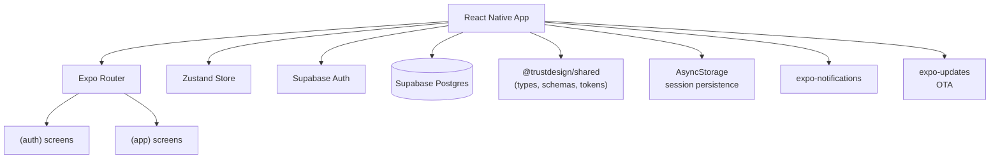

# Architecture

> Update this document whenever significant architectural decisions are made.

## System Overview

starter-native is a React Native (Expo) mobile app starter. It connects to Supabase for
authentication and data, uses Expo Router for file-based navigation, and pulls shared
types, schemas, and design tokens from the `@trustdesign/shared` package.

## Navigation Model

Expo Router uses file-based routing. Screen files live under `src/app/` in the repo.
The table below shows route groups (used as path strings in code) alongside their
file system locations.

| Route group | File path | Purpose | Access |
|-------------|-----------|---------|--------|
| `(auth)` | `src/app/(auth)/` | Sign in, sign up | Public — redirect away if authenticated |
| `onboarding` | `src/app/onboarding/` | First-run flow | Authenticated users without `onboardingCompletedAt` |
| `(app)/(tabs)` | `src/app/(app)/(tabs)/` | Tab bar (home, explore, account) | Authenticated + onboarded |
| `(app)/profile` | `src/app/(app)/profile/` | Profile editing | Authenticated + onboarded (stack push) |
| `(app)/settings` | `src/app/(app)/settings/` | App settings | Authenticated + onboarded (stack push) |

The root layout at `src/app/_layout.tsx` enforces all redirect logic via a single `useEffect` watching `user` and `isLoading` from the Zustand auth store.

## Auth Flow

1. App starts → `SplashScreen.preventAutoHideAsync()` holds the splash
2. `AuthProvider` subscribes to `supabase.auth.onAuthStateChange`
3. Session loaded (or confirmed absent) → `isLoading = false` → splash hides
4. Root layout checks auth state and redirects:
   - No user → `/(auth)/sign-in`
   - User without `onboardingCompletedAt` → `/onboarding`
   - User with `onboardingCompletedAt` → `/(app)/(tabs)`
5. Session persists across app restarts via `AsyncStorage`

## Data Flow

1. User interacts with a screen
2. Screen calls a lib function from `src/lib/` (e.g. `signInWithEmail`, `updateProfile`)
3. Lib function calls Supabase directly and returns an `ActionResult`
4. On success, the Zustand store is updated
5. Screens that subscribe to the relevant store slice re-render automatically

There is no ORM or server layer — Supabase is called directly from the client.
Data validation uses Zod schemas from `@trustdesign/shared/schemas`.

## Shared Package

`@trustdesign/shared` is a Git dependency installed from `github:trustdesign-io/trustdesign-shared`. It provides:

| Export | Contents |
|--------|----------|
| `@trustdesign/shared/tokens` | `colors`, `spacing`, `borderRadius`, `fontSize` |
| `@trustdesign/shared/types` | `User`, `Role`, `ActionResult` |
| `@trustdesign/shared/schemas` | `SignInSchema`, `SignUpSchema` (Zod) |
| `@trustdesign/shared/supabase` | `createSupabaseClient` factory |

All shared code must be platform-agnostic — no DOM, no Node.js, no Next.js APIs.

## Key Architectural Decisions

| Decision | Choice | Alternatives considered | Rationale |
|----------|--------|------------------------|-----------|
| Navigation | Expo Router | React Navigation bare | File-based routing, typed routes, deep linking |
| Auth | Supabase Auth | Firebase Auth, Clerk | Shared DB integration, one provider, no cost at small scale |
| State | Zustand | Redux, Context | Minimal boilerplate, no provider wrapping |
| Styling | StyleSheet + design tokens | NativeWind, styled-components | No build-time transforms needed, native performance |
| Session persistence | AsyncStorage | expo-secure-store | Supabase RN adapter default; `expo-secure-store` used only for sensitive values |

## Performance Considerations

- Lists: use `FlatList` or `SectionList` with `keyExtractor` for all dynamic lists — never `ScrollView` + `.map()`
- Images: use `expo-image` for automatic caching and progressive loading
- Heavy screens: use `React.lazy` or load data in `useEffect` with a loading state
- Re-renders: use `useCallback` and `useMemo` where profiler shows a real problem — not as a default

## Security Considerations

- All Supabase calls run with the anon key — protected by Row Level Security policies
- Sensitive values (service role key etc.) must never appear in client code or `EXPO_PUBLIC_` env vars
- User input is validated with Zod before sending to Supabase
- Notifications: the app requests permission only when needed, with an explanation
- Deep links: only the registered scheme (`starter-native://`) is handled

## Deployment

See `docs/SETUP.md` for full build and release instructions.

- **Development:** Expo Dev Client (`npm start`)
- **Builds:** EAS Build (managed workflow, cloud)
- **OTA updates:** EAS Update / expo-updates (non-breaking JS-layer updates)
- **Release:** EAS Submit to App Store and Google Play
